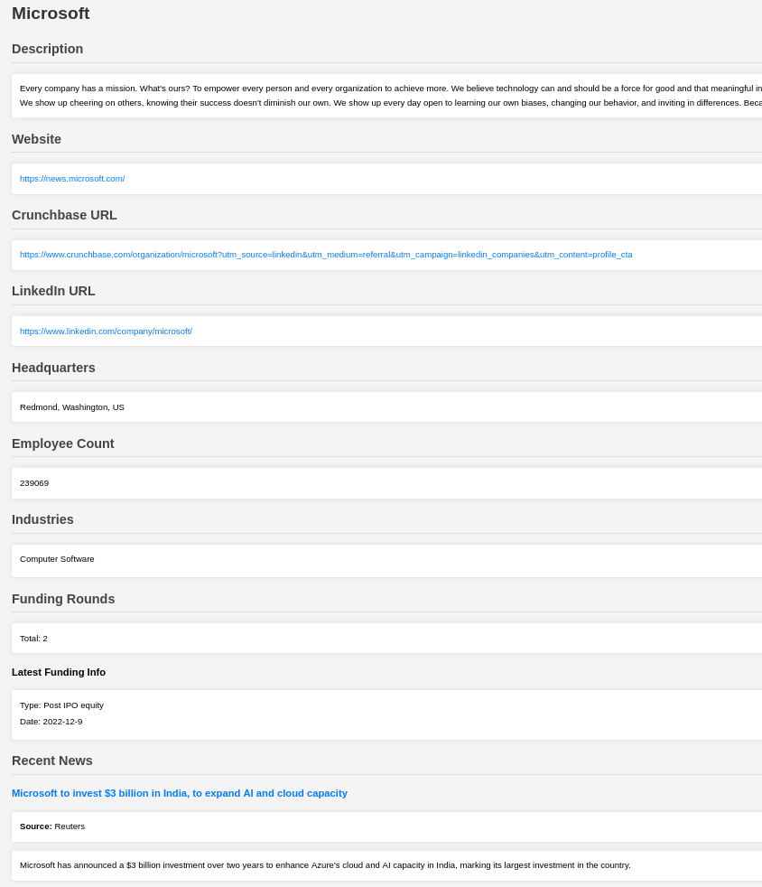

# AI Agent Company Analyzer

## Overview
The AI Agent Company Analyzer is an Apify Actor that takes a query as input, extracts the company name, and gathers detailed information from various sources across the web. The actor provides both structured JSON output and an HTML report containing the findings.

## Features
- Extracts company information from a given query
- Gathers details such as basic company information, funding history, employee statistics, and headquarters location
- Collects relevant news articles about the company
- Parses the details to create a concise summary of the company.
- Generates structured JSON output and an HTML report

## Input
The Actor requires the following input in JSON format:

```json
{
    "companyRequest": "Tell me about Microsoft's business",
    "OPENAI_API_KEY": "YOUR_OPENAI_API_KEY" //optional
}
```

### Input Fields
- `companyRequest` (string): A query containing the company name and the type of information required.
- `OPENAI_API_KEY` (string - optional): Your OpenAI API key for natural language processing.

## Output
The Actor generates two types of output:

### HTML Report

An HTML report is also generated, summarizing the collected information in a visually structured format.

### JSON Output
The structured JSON output includes details about the company, such as:

```json
{
    "results": [
        {
            "basic_info": {
                "name": "Microsoft",
                "universal_name": "microsoft",
                "description": "Every company has a mission...",
                "website": "https://news.microsoft.com/",
                "linkedin_url": "https://www.linkedin.com/company/microsoft/",
                "specialties": ["AI", "Cloud Computing", "Gaming"],
                "industries": ["Computer Software"],
                "is_verified": true
            },
            "stats": {
                "employee_count": 239069,
                "follower_count": 25034990
            },
            "locations": {
                "headquarters": {
                    "country": "US",
                    "state": "Washington",
                    "city": "Redmond",
                    "postal_code": "98052",
                    "line1": "1 Microsoft Way"
                }
            },
            "funding": {
                "total_rounds": 2,
                "latest_round": {
                    "type": "Post IPO equity",
                    "date": { "year": 2022, "month": 12, "day": 9 },
                    "url": "https://www.crunchbase.com/funding_round/microsoft-post-ipo-equity..."
                }
            },
            "news": [
                {
                    "title": "Microsoft to invest $3 billion in India...",
                    "source": "Reuters",
                    "link": "https://www.reuters.com/...",
                    "summary": "Microsoft has announced a $3 billion investment..."
                }
            ]
        }
    ]
}
```

## Usage
1. Deploy the Actor on Apify.
2. Provide the required input (company query and API key).
3. Execute the Actor and retrieve the JSON output or the HTML report from the Apify dataset.

## Example Use Case
- Competitive analysis for businesses
- Market research
- Tracking company news and trends

## Limitations
- The quality of extracted information depends on the availability of online data sources.
- API rate limits may apply when using OpenAI for query processing.